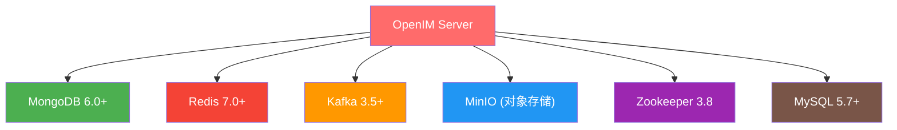
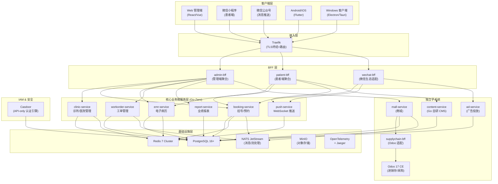
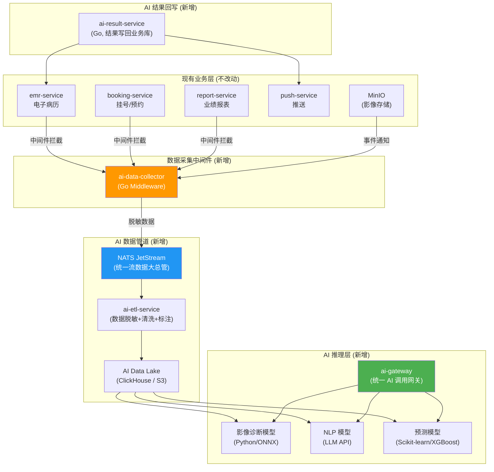

# 口腔医院医务 SaaS 系统 — 架构与软件选型分析报告

> **定位**: 面向口腔（及未来宠物）医疗行业的多租户 SaaS 平台
> **覆盖**: B 端医护管理 + C 端医患交互 + 商业变现闭环
> **视角**: 20 年全栈架构师，兼顾业界实践与团队落地可行性

---

## 一、需求全景与核心矛盾分析

### 1.1 需求矩阵

| # | 需求 | 领域 | 复杂度 | 优先级 |
|---|------|------|--------|--------|
| 1 | 医患管理（咨询/挂号/计划）+ 微信对接 | 核心诊疗 | ★★★★ | P0 |
| 2 | 医院内工单管理 | 运营协同 | ★★☆ | P1 |
| 3 | 耗材管理（进销存） | 供应链 | ★★★ | P1 |
| 4 | 员工 IM 交流 | 即时通讯 | ★★★★ | P1 |
| 5 | 跨端（Web/Win/Android/iOS） | 前端工程 | ★★★ | P0 |
| 6 | 多医院 + 数据隔离 | 多租户 SaaS | ★★★★★ | P0 |
| 7 | 主页/博客/论坛 | 内容平台 | ★★☆ | P2 |
| 8 | 商城系统（采购） | 电商 | ★★★ | P2 |
| 9 | 扩展至宠物医院 | 架构弹性 | ★★★ | P2 |
| 10 | 业绩报表 | 数据分析 | ★★☆ | P1 |
| 11 | AI 辅助开发，系统本身不用 AI | 工程效率 | — | — |
| 12 | 集成/基于开源软件 | 降成本 | — | — |
| 13 | 高性能、高并发、可快速扩展 | 架构要求 | ★★★★ | P0 |
| 14 | 免费提供 + 广告/商城/IM 盈利 | 商业模式 | ★★★ | P1 |
| 15 | 调研 Odoo / OpenIM 是否合适 | 选型决策 | — | P0 |

### 1.2 核心矛盾识别

> [!IMPORTANT]
> 本项目存在 **三大核心矛盾** 需要架构层面直面解决：

1. **功能广度 vs. 交付速度**: 15 项需求覆盖了诊疗、ERP、IM、CMS、电商、BI 六大领域，若全部自研，中小团队交付周期可能长达 2-3 年
2. **免费提供 vs. 运维成本**: 免费 SaaS 意味着用户数增长快但营收滞后，技术栈越重运维成本越高
3. **多技术栈整合 vs. 运维简单化**: Odoo(Python) + OpenIM(Go+重依赖) + 主服务(Go) + CMS(Node.js)，四套技术栈的运维成本指数级增长

---

## 二、Odoo 深度适用性分析

### 2.1 Odoo 社区版能力边界

| 能力维度 | 社区版支持 | 评价 |
|---------|-----------|------|
| 进销存(库存/采购/销售) | ✅ 核心模块完整 | **强项**，开箱即用 |
| 患者/客户管理 | ✅ CRM + 联系人模块 | 可适配但非原生 |
| 财务/发票 | ⚠️ 基础模块，缺高级会计 | 口腔诊所级别够用 |
| 工单管理 | ⚠️ 项目模块可适配 | 简单工单可用 |
| HR/员工管理 | ⚠️ 基础模块 | 缺招聘/绩效/薪酬 |
| 移动端支持 | ❌ 社区版无官方 App | **硬伤** |
| 官方技术支持 | ❌ 无 | 需自行维护 |
| 医疗行业模块 | ⚠️ 需社区/第三方扩展 | 质量不可控 |
| 微信生态对接 | ❌ 无原生支持 | 需完全自研 |
| 多租户 | ⚠️ 需额外方案 | 社区版不原生支持 |

### 2.2 Odoo 在本项目中的定位建议

> [!TIP]
> **结论: Odoo 适合作为 ERP 子系统（进销存+采购），不适合作为主平台。**

**推荐用法**:
- ✅ 将 Odoo **仅用于耗材进销存 + 商城采购后台** — 这是 Odoo 的绝对强项
- ✅ 通过 **BFF 适配层** (Backend for Frontend) 将 Odoo XML-RPC/JSON-RPC 接口包装为统一 REST/gRPC 服务
- ✅ 使用 **消息队列** 做异步事件驱动解耦（订单创建、库存变更等）
- ❌ 不要尝试用 Odoo 替代核心诊疗业务系统（患者管理、电子病历、挂号）— Odoo 的医疗模块成熟度远不够
- ❌ 不要直接暴露 Odoo Web UI 给终端用户 — 与全局统一 UX 冲突

**集成架构**:
```
┌────────────────┐      gRPC/REST      ┌──────────────────────┐
│  主业务微服务   │  ◄──────────────►   │  supplychain-bff     │
│  (Go-Zero)     │                     │  (Go 适配层)          │
└────────────────┘                     └──────────┬───────────┘
                                                  │ XML-RPC
                                                  ▼
                                       ┌──────────────────────┐
                                       │  Odoo Community 17+  │
                                       │  (进销存/采购/库存)    │
                                       │  PostgreSQL 独立库    │
                                       └──────────────────────┘
```

**Odoo 运维注意**:
- Odoo 是 Python 技术栈，与 Go 主体技术栈在运维上是割裂的
- 建议 Odoo 容器化部署，独立 PostgreSQL schema
- 安排专门的 Odoo 配置/定制能力（团队中需有懂 Python/Odoo ORM 的人）

---

## 三、OpenIM 深度适用性分析

### 3.1 OpenIM 依赖全景



> [!WARNING]
> OpenIM 需要 **6 个中间件** 联合部署，最低 4GB RAM，推荐 K8s 部署时需 4 CPU + 8G 内存 + 100G 磁盘。这对于一个"免费提供"的 SaaS 系统来说，IM 子系统的基础设施成本过高。

### 3.2 OpenIM 适用性评估

| 维度 | 评价 | 详情 |
|------|------|------|
| **功能完备度** | 🟢 优秀 | 单聊/群聊/消息推送/已读未读/离线消息/文件传输，功能极为完整 |
| **私有化部署** | 🟢 优秀 | 完全自主可控，符合医疗数据合规要求 |
| **SDK 多端支持** | 🟢 良好 | Web/Android/iOS/Flutter SDK |
| **运维复杂度** | 🔴 过高 | 6 个中间件依赖，故障排查面极大 |
| **资源消耗** | 🔴 过高 | 对免费 SaaS 的成本模型不友好 |
| **多租户支持** | 🟡 需定制 | 未原生支持 tenant_id 级别隔离 |
| **与主系统耦合** | 🟡 中等 | 需要额外的用户同步、权限映射工作 |
| **性能指标** | 🟢 优秀 | 压测 5 万并发在线 + 1700 条/秒消息 |

### 3.3 IM 方案分层策略建议

> [!IMPORTANT]
> **结论: 不建议 MVP 阶段引入 OpenIM，采用分阶段递进策略。**

#### Phase 1 (MVP): 轻量自研 + 微信原生能力

```
┌──────────────────────────────────────────────────────────┐
│                     Phase 1 - 轻量 IM                     │
├──────────────────────────────────────────────────────────┤
│  医患沟通:  微信小程序客服消息 + 模板消息推送               │
│  内部协同:  自研 WebSocket 消息通道 (基于 push-service)     │
│  工单通知:  企业微信 Webhook / 系统内消息中心              │
│  消息存储:  PostgreSQL JSONB (消息量不大时性能足够)        │
└──────────────────────────────────────────────────────────┘
```

**优势**: 零外部 IM 依赖、运维简单、开发成本低、微信内直接触达患者

#### Phase 2 (Scale): 引入 OpenIM 或评估替代

当满足以下条件时引入完整 IM：
- 日活跃用户 > 5000
- 产品需求确认"院内 IM"是核心留存手段
- 基础设施团队已成熟（能运维 Kafka + MongoDB 集群）
- 盈利模式验证通过，有预算支撑

**替代方案评估**:

| 方案 | 优势 | 劣势 |
|------|------|------|
| OpenIM | 功能最全、Go 原生 | 依赖最重（6 组件） |
| 自研(WebSocket+Redis Pub/Sub) | 最轻量、完全可控 | 功能有限，需时间积累 |
| 融云/环信 SDK | 快速集成、运维成本低 | 非开源、数据不受控、长期成本高 |
| Matrix/Synapse | 开源、联邦协议 | Python 性能差、生态偏极客 |

---

## 四、推荐架构设计

### 4.1 总体架构概览



### 4.2 多租户隔离策略

```
┌─────────────────────────────────────────────────────┐
│                  多租户隔离四层防线                    │
├─────────────────────────────────────────────────────┤
│ L1 - 路由层:  Traefik 映射 → 基础路由识别              │
│ L2 - 认证层:  BFF 校验 JWT → 解析 tenant_id          │
│ L3 - 应用层:  Go-Zero Middleware → ctx 注入 tenant_id │
│ L4 - 数据层:  GORM Session → 设置 SET LOCAL search_path│
│               + Schema 级物理表隔离                   │
└─────────────────────────────────────────────────────┘
```

**多租户数据模型选择**: **共享数据库 + Schema 级隔离 (SET LOCAL search_path)**

理由：
- 口腔诊所规模不宜采用"一租户一库"（管理成本太高）
- PostgreSQL 共享库 + Schema 级别隔离，兼顾了成本与高安全/私有化部署便利性
- 配合 `tenant_tree` 与 LTREE 分析功能以应对复杂的连锁级（多层次）租户

### 4.3 宠物医院扩展设计

```
┌─────────────────────────────────────────────────────────┐
│                   垂直领域扩展策略                         │
├─────────────────────────────────────────────────────────┤
│  1. 业务类型枚举: tenant_type ∈ {dental, veterinary, ...} │
│  2. EMR 的 JSONB 字段天然适应不同科室的结构化差异          │
│  3. 核心流程(挂号/诊疗/收费)是通用的，差异在字段层面       │
│  4. 前端使用动态表单渲染(JSON Schema → Form)              │
│  5. 按 tenant_type 加载不同的配置/表单模板                 │
└─────────────────────────────────────────────────────────┘
```

---

## 五、完整技术栈选型

### 5.1 后端技术栈

| 组件 | 选型 | 版本 | 理由 |
|------|------|------|------|
| **微服务框架** | Go-Zero | 1.7+ | 高性能、内置链路追踪/限流/熔断、`goctl` 代码生成配合 AI 开发效率高 |
| **ORM** | GORM | 2.x | 统一使用 GORM（不与 sqlx 混用），利用 Hook 做租户拦截和审计 |
| **API Gateway** | Traefik | v3 | 轻量云原生、零配置服务发现、自动 HTTPS，聚合/限流/身份验证交由 Go-Zero BFF 处理 |
| **IAM** | Casdoor | latest | 降级为 API-only 模式，前端 UI 纯自研提供完美白标定制能力 |
| **关系数据库** | PostgreSQL | 16+ | JSONB、Schema隔离、逻辑复制、LTREE查询、医疗数据优选 |
| **缓存** | Redis | 7+ | Cluster 模式、Lua 脚本原子操作(防超卖)、主要用于缓存加速 |
| **消息/流处理** | NATS JetStream | latest | 纯 Go 编写极其轻量、支持多租户、直接包揽事件总线/推送网关通讯/AI 流处理数据管道 |
| **对象存储** | MinIO | latest | S3 兼容、私有化部署、存储 DICOM 影像 (牙片/CT) |
| **ERP** | Odoo CE | 17+ | 仅用于进销存+采购，BFF 层解耦 |
| **链路追踪** | OpenTelemetry + Jaeger | — | Go-Zero 原生支持，全链路可观测 |
| **日志** | Loki + Promtail (或 ELK) | — | 轻量级日志聚合 |
| **监控** | Prometheus + Grafana | — | 业界标准 |
| **CI/CD** | GitLab CI / GitHub Actions | — | 按团队偏好 |
| **容器编排** | Docker Compose (dev) + K8s (prod) | — | 渐进式，开发阶段 Compose，生产 K8s |
| **DB 迁移** | golang-migrate 或 Atlas | — | 版本化 Schema 管理 |
| **ID 生成** | ULID | — | 有序+时间戳+随机，B-Tree 友好 |

### 5.2 前端技术栈

| 端 | 技术选型 | 理由 |
|----|---------|------|
| **Web 管理端** | React 18 + Ant Design Pro | 企业管理系统成熟方案，组件丰富，AI 代码生成资料多 |
| **微信小程序（患者端）** | Taro 3.x (React 语法) | 一套代码编译微信小程序 + H5，与 Web 端共享组件逻辑 |
| **微信公众号** | 服务号 + Taro H5 | 模板消息推送 + 菜单跳转小程序/H5 |
| **Android/iOS** | Flutter 3.x | 一套代码两端发布，性能接近原生，IM UI 定制灵活 |
| **Windows 客户端** | Tauri 2.x (Rust+Web) | 比 Electron 体积小 10 倍、内存占用低、可嵌入 Web 管理端 |

> [!TIP]
> **跨端策略核心思路**: Web 管理端(React) + 小程序(Taro/React) + App(Flutter) + Win客户端(Tauri封装Web)。总共只需维护 3 套代码（React Web、Taro 小程序、Flutter App），Tauri 客户端直接包装 Web 端。

### 5.3 内容 & 社区方案 (博客/论坛/主页)

> [!WARNING]
> 之前方案使用 Strapi (Node.js CMS)，会引入第三方技术栈。建议改为 **Go 自研轻量 CMS 模块**。

**推荐方案**: 在 `content-service` 中自研

| 功能 | 实现方式 |
|------|---------|
| 博客/文章 | Markdown → PostgreSQL (JSONB 存储结构化内容) |
| 论坛/问答 | 帖子 + 评论 + 点赞/收藏 (经典 BBS 模型) |
| 个人主页 | 医生/医护人员资料 + 关联文章列表 + 执业信息 |
| SEO 渲染 | Go 模板引擎 SSR 或前端 SSG |
| 富文本编辑 | 前端 Tiptap/Editor.js → 后端存 JSON |

理由：
- 避免引入 Node.js 技术栈（保持 Go + Python(Odoo) 两栈已是底线）
- 博客/论坛需求相对简单，自研成本可控
- 数据与主系统同库，利于全文搜索和关联查询

---

## 六、微服务拆分与职责

```
hos1-opus/
├── gateway/                    # Traefik 配置与插件
├── bff/
│   ├── admin-bff/             # 管理后台聚合层
│   ├── patient-bff/           # 患者端聚合层
│   └── wechat-bff/            # 微信生态适配层 (公众号/小程序)
├── services/
│   ├── clinic-service/        # 诊所管理 (医院配置/科室/医生排班)
│   ├── booking-service/       # 预约挂号 + 分诊叫号
│   ├── emr-service/           # 电子病历 (JSONB + HL7 FHIR 参考)
│   ├── workorder-service/     # 工单管理 (院内工单流转)
│   ├── report-service/        # 业绩报表 + 数据分析
│   ├── push-service/          # WebSocket 推送 + 消息中心
│   ├── content-service/       # 博客/论坛/个人主页 (自研 CMS)
│   ├── mall-service/          # 商城系统 (商品/订单/支付)
│   ├── ad-service/            # 广告投放 (健康科普广告 + 商城排名)
│   └── supplychain-bff/       # 进销存 BFF (适配 Odoo)
├── common/
│   ├── middleware/             # TenantCheck, DataMasking, AuditLog
│   ├── pkg/                   # 公共库 (ULID, redisx, mqx, crypto, errors)
│   └── proto/                 # 共享 protobuf 定义
├── infra/
│   ├── casdoor/               # IAM 配置
│   └── odoo/                  # Odoo 部署与自定义模块
├── deployments/
│   ├── docker-compose/        # 开发环境编排
│   └── k8s/                   # 生产 K8s 编排
├── scripts/                   # 自动化脚本 (初始化/迁移/部署)
├── docs/                      # 架构文档/API 文档
├── frontend/
│   ├── admin-web/             # React 18 + Ant Design Pro + Tailwind
│   ├── patient-mp/            # Taro 小程序
│   └── app/                   # Flutter App
└── go.work                    # Go Workspace
```

---

## 七、关键架构决策清单

### 7.1 安全与合规

| 决策点 | 方案 |
|--------|------|
| PII 数据保护 | 存储层 AES-GCM 加密 + API 层 Tag 动态脱敏 + Unmask 审计接口 |
| 审计日志 | 统一审计中间件 (WHO/WHEN/WHAT/HOW)，append-only 存储 |
| 多租户越权防护 | 四层防线 (网关→认证→应用→数据) |
| 微信数据合规 | 满足 PIPL 个人信息保护法，健康数据本地化存储 |

### 7.2 高性能设计

| 场景 | 方案 |
|------|------|
| 挂号防超卖 | Redis Lua 原子预扣 → MQ 异步确认 → Outbox 最终一致 |
| 分诊/叫号实时 | WebSocket 长连接 + Redis Pub/Sub 事件广播 |
| 报表查询 | 物化视图 + 异步预聚合 + 读写分离 |
| 影像文件 | MinIO 分布式存储 + CDN 加速 + 缩略图预生成 |
| 数据库伸缩 | PostgreSQL 读写分离 → 未来按租户 Sharding |

### 7.3 分布式事务

**策略**: Saga 编排 + Outbox 模式 + 最终一致性，**禁止 2PC**

```
挂号事务示例:
  booking-service → 创建预约 (pending)
  → MQ 事件 → clinic-service 校验号源
  → MQ 事件 → 支付服务确认
  → MQ 事件 → booking-service 更新为 confirmed
  → 失败补偿 → 逆向 Saga 回滚
```

---

## 八、盈利机制的技术支撑

| 盈利手段 | 技术实现 |
|---------|---------|
| **公众号/小程序推送口腔健康广告** | ad-service 管理广告位 + 定向投放算法 + 微信模板消息 |
| **IM 增加使用时长** | push-service 消息推送 + 定时健康提醒 + 诊后随访 |
| **商城广告排名费用** | mall-service 商品搜索排序加权 + 竞价排名 + 曝光计费 |
| **增值服务(未来)** | 报表高级版、影像云存储扩容、连锁管理模块 |

---

## 九、开源软件选型终评矩阵

| 组件 | 选型 | 评级 | 关键说明 |
|------|------|------|---------|
| 微服务框架 | Go-Zero | 🟢 推荐 | `goctl` 代码生成利于 AI 辅助开发，统一 ORM 用 GORM |
| API Gateway | Traefik | 🟢 推荐 | 配合 Go-Zero BFF，全链路去 Lua，运维更简洁轻薄 |
| IAM | Casdoor | 🟢 推荐 | 采用 API-only 模式，解除其自带 UI 对租户品牌的视觉污染 |
| 关系数据库 | PostgreSQL 16+ | 🟢 优秀 | JSONB + Schema 级隔离 + LTREE 树形查询 |
| 缓存 | Redis 7 | 🟢 优秀 | 保持加速功能 |
| 消息队列 | NATS JetStream | 🟢 优秀 | 全面替换 RabbitMQ，打通长连接/业务/AI 的数据主干道 |
| ERP/进销存 | Odoo CE 17 | 🟢 合理 | **仅限进销存，BFF 解耦** |
| IM | 自研轻量 → OpenIM(Phase2) | 🟡 分阶段 | MVP 用 WebSocket+微信，规模化后再引入 |
| CMS | Go 自研 content-service | 🟢 推荐 | 避免引入 Node.js/Strapi 第三方技术栈 |
| 对象存储 | MinIO | 🟢 推荐 | S3 兼容，牙片/影像存储 |
| 前端(Admin) | React 18 + Ant Design Pro + Tailwind | 🟢 推荐 | 企业管理系统标准方案 |
| 前端(小程序) | Taro 3.x | 🟢 推荐 | React 语法，一码两端 |
| 前端(App) | Flutter | 🟢 推荐 | 一码两端，性能优秀 |
| 前端(Win) | Tauri 2.x | 🟢 推荐 | 轻量桌面端，封装 Web |
| WebSocket | nhooyr.io/websocket | 🟢 推荐 | 替代已归档的 Gorilla |
| 链路追踪 | OpenTelemetry + Jaeger | 🟢 优秀 | Go-Zero 原生支持 |
| 监控 | Prometheus + Grafana | 🟢 标准 | — |
| 日志 | Loki + Promtail | 🟢 轻量 | 比 ELK 运维简单 |
| 容器编排 | Docker Compose + K8s | 🟢 标准 | 渐进式部署 |

---

## 十、与 hos2-gemini 方案的对比改进

| 维度 | hos2-gemini 方案 | 本方案改进 |
|------|----------------|-----------|
| CMS | Strapi (Node.js) | Go 自研 content-service (**减少一个技术栈**) |
| IM | 直接引入 OpenIM | 分阶段: 轻量自研 → OpenIM (**降低 MVP 运维成本**) |
| API Gateway | Nginx 直接反代 | Traefik + BFF (**全链路 Go 栈可调试，简化运维**) |
| WebSocket | Gin + Gorilla | Go-Zero HTTP + nhooyr.io/websocket (**消除已弃用依赖**) |
| 项目结构 | 扁平微服务 | bff/ + services/ + common/ 分层 (**职责更清晰**) |
| 前端 Win 客户端 | 未明确 | Tauri 2.x 封装 Web (**轻量高效**) |
| DB 迁移 | 手写 SQL | golang-migrate 版本化管理 (**CI/CD 友好**) |
| ID 策略 | VARCHAR(32) 未明确 | ULID 统一生成 (**有序+唯一+B-Tree 友好**) |

---

## 十一、分阶段实施路线

### Phase 1 — MVP (3-4 个月)
```
✅ 核心: clinic-service + booking-service + emr-service
✅ 认证: Casdoor + 微信小程序登录
✅ 前端: Admin Web + 患者小程序 + 自研登录模块
✅ 推送: push-service 作为网关并连通内部 NATS
✅ 基础: PostgreSQL + Redis + NATS JetStream + MinIO (t-{id}隔离)
✅ 部署: Docker Compose + CI/CD
```

### Phase 2 — 深化 (2-3 个月)
```
✅ 工单: workorder-service
✅ 进销存: Odoo + supplychain-bff
✅ 内容: content-service (博客/论坛)
✅ 报表: report-service
✅ 前端: Flutter App + Tauri Win 客户端
```

### Phase 3 — 商业化 (2-3 个月)
```
✅ 商城: mall-service
✅ 广告: ad-service
✅ 公众号: 模板消息 + 广告推送
✅ IM 升级: 评估引入 OpenIM 或深化自研
✅ 宠物医院: tenant_type 扩展 + 差异化表单
```

### Phase 4 — 规模化
```
✅ K8s 生产集群
✅ 读写分离 + 分库分表(按需)
✅ CDN + 边缘节点
✅ 安全审计 + 等保合规
✅ SLA 监控 + 告警体系
```

---

## 十二、风险与缓解

| 风险 | 影响 | 缓解措施 |
|------|------|---------|
| Casdoor 安全漏洞 | 🔴 高 | 做好 IAM 抽象层，定期安全审计，备选 Keycloak |
| Odoo 升级兼容性 | 🟡 中 | BFF 层隔离，Odoo 锁定版本，独立升级 |
| 多租户数据泄露 | 🔴 高 | 四层防线 + PostgreSQL RLS + 定期渗透测试 |
| 技术栈人才招聘 | 🟡 中 | Go + PostgreSQL 是主流栈，招聘难度可控 |
| 免费模式下成本失控 | 🟡 中 | 最小化中间件数量、容器资源配额、尽早验证盈利 |
| OpenIM 后期引入迁移成本 | 🟡 中 | Phase 1 抽象消息接口层，切换时仅替换实现 |

---

## 十三、AI 扩展性架构设计

> [!IMPORTANT]
> 当前架构要求"系统本身不使用 AI"，但需要为 **未来引入 AI** 预留快速扩展能力。以下设计确保：AI 引入时 **零侵入核心业务代码**，仅需新增独立服务 + 接通数据管道。

### 13.1 口腔医疗 AI 应用场景全景

| # | AI 场景 | 输入数据 | 输出 | 优先级 | 复杂度 |
|---|---------|---------|------|--------|--------|
| 1 | **牙片/CBCT AI 辅助诊断** | 全景片、根尖片、CBCT 影像 | 龋齿/牙周病/根尖病变标注 + 置信度 | ★★★★★ | 高 |
| 2 | **智能预分诊** | 患者主诉文本 + 症状选择 | 推荐科室/医生 + 紧急度评估 | ★★★★ | 中 |
| 3 | **诊后智能总结** | 电子病历 JSONB 数据 | 患者可读的诊疗总结 (NLP 生成) | ★★★ | 中 |
| 4 | **治疗方案推荐** | 病历 + 影像 + 历史治疗 | 推荐治疗路径 + 费用预估 | ★★★ | 高 |
| 5 | **患者智能客服** | 患者文字/语音问题 | FAQ 回答 + 转人工判断 | ★★★ | 低 |
| 6 | **口腔健康科普内容生成** | 关键词/主题 | SEO 友好的科普文章 | ★★ | 低 |
| 7 | **经营数据预测** | 历史挂号/收入/耗材数据 | 患者流失预警 + 营收预测 | ★★★ | 中 |
| 8 | **耗材智能补货** | 库存消耗趋势 | 自动生成采购建议单 | ★★ | 中 |

### 13.2 AI-Ready 数据管道架构 (零侵入设计)

核心理念：**在业务代码主干路上，通过中间件 + MQ 旁路拷贝脱敏数据，而非修改业务逻辑**。



**设计要点**:

1. **零侵入**: 业务服务代码**完全不修改**，仅在 `common/middleware/` 中新增 `AIDataCollector` 中间件
2. **脱敏优先**: 中间件在拷贝数据投递到 AI 管道前，自动执行 PII 脱敏（复用已有的 DataMasking 逻辑）
3. **异步解耦**: 业务请求响应不受 AI 处理延时影响（MQ 异步投递）
4. **独立数据存储**: AI 数据湖使用独立的 ClickHouse/S3，不影响业务库 PostgreSQL 性能

### 13.3 AI Gateway 统一调用网关

```
┌──────────────────────────────────────────────────────────────┐
│                     ai-gateway (Go 服务)                      │
├──────────────────────────────────────────────────────────────┤
│  统一接口:  POST /api/v1/ai/infer                             │
│  请求格式:  { "model": "dental-xray-v1", "input": {...} }    │
│  响应格式:  { "result": {...}, "confidence": 0.95 }          │
├──────────────────────────────────────────────────────────────┤
│  路由策略:  按 model 名称路由到不同的推理后端                   │
│  限流熔断:  AI 推理资源昂贵，按租户/API 维度限流               │
│  结果缓存:  相同输入 hash → Redis 缓存推理结果                 │
│  审计日志:  记录每次 AI 调用 (合规要求)                        │
│  A/B 测试:  同一场景可配置多个模型版本做灰度对比               │
├──────────────────────────────────────────────────────────────┤
│  后端适配器 (Plugin 模式):                                    │
│  ├── LocalONNXAdapter     → 本地 ONNX Runtime 推理           │
│  ├── OpenAIAdapter        → GPT-4o / Claude API             │
│  ├── HuggingFaceAdapter   → HF Inference API                │
│  ├── CustomHTTPAdapter    → 自部署 Python 模型 (FastAPI)     │
│  └── TritonAdapter        → NVIDIA Triton Inference Server  │
└──────────────────────────────────────────────────────────────┘
```

**为什么需要 AI Gateway?**
- 统一接口：业务层调用 AI 只需关心 `model` + `input`，不关心后端是本地模型还是云 API
- 模型可替换：今天用 OpenAI，明天切自部署模型，业务代码零修改
- 成本控制：集中管控 AI API 调用频率和费用
- 合规审计：医疗 AI 辅助诊断需要完整的调用记录

### 13.4 各业务服务的 AI 扩展点

| 现有服务 | AI 扩展点 | 接入方式 | 改动量 |
|---------|----------|---------|--------|
| **emr-service** | 影像 AI 辅助诊断结果回写 | ai-result-service 通过 gRPC 回写 `ai_diagnosis` JSONB 字段 | **+1 个字段** |
| **booking-service** | 智能预分诊推荐科室 | BFF 层调用 ai-gateway，用推荐结果填充前端下拉 | **BFF 新增 1 个接口** |
| **push-service** | AI 生成的诊后总结推送 | ai-result-service → MQ → push-service 推送 | **已有 MQ 消费逻辑，零改动** |
| **content-service** | AI 生成科普文章草稿 | 管理后台调用 ai-gateway → 生成 → 人工审核发布 | **前端新增按钮** |
| **report-service** | 经营预测 + 异常告警 | 异步定时任务读取数据 → ai-gateway 推理 → 结果入报表 | **+1 个定时任务** |
| **supplychain-bff** | 智能补货建议 | 异步分析消耗趋势 → ai-gateway → 生成采购建议单 | **+1 个异步任务** |
| **mall-service** | 智能商品推荐 | BFF 层调用 ai-gateway 做个性化推荐 | **BFF 新增 1 个接口** |

### 13.5 AI 引入的分阶段路线

```
Phase A (低成本快赢):
  ├── 患者智能客服 → 调用商业 LLM API (如 GPT-4o/通义千问) + RAG 知识库
  ├── 科普内容辅助生成 → LLM API + 人工审核
  └── 预计额外投入: 1 人·月 + API 费用

Phase B (核心价值):
  ├── 智能预分诊 → NLP 分类模型 (可用 LLM 或微调小模型)
  ├── 诊后智能总结 → LLM 提取 + 模板渲染
  └── 预计额外投入: 2 人·月

Phase C (深度 AI):
  ├── 牙片 AI 辅助诊断 → 需与 FDA/NMPA 认证的影像 AI 厂商合作
  │                        或自训练模型 (需大量标注数据 + GPU 算力)
  ├── 治疗方案推荐 → 知识图谱 + 推理引擎
  ├── 经营数据预测 → 时序预测模型 (Prophet/LSTM)
  └── 预计额外投入: 6+ 人·月 + GPU 基础设施
```

### 13.6 架构对 AI 的快速扩展能力总评

| 扩展维度 | 现有架构支持度 | 说明 |
|---------|--------------|------|
| **数据可获取性** | 🟢 **优秀** | 所有业务数据在 PostgreSQL (JSONB)，影像在 MinIO (S3 API)，MQ 中间件可旁路拷贝 |
| **零侵入接入** | 🟢 **优秀** | Go Middleware 机制 + MQ 异步管道，不修改业务逻辑 |
| **模型可替换** | 🟢 **优秀** | ai-gateway Plugin 架构，后端可热切换 |
| **推理结果回写** | 🟢 **优秀** | 通过已有 gRPC + MQ 通道回写，EMR 的 JSONB 天然支持新增 AI 字段 |
| **多租户隔离** | 🟢 **优秀** | AI 数据管道继承 tenant_id，各医院 AI 数据完全隔离 |
| **成本可控** | 🟢 **优秀** | ai-gateway 统一限流 + 缓存，避免 AI API 费用失控 |
| **GPU 基础设施** | 🟡 **需新增** | 深度影像 AI 需新增 GPU 节点 (K8s GPU Node Pool)，但对现有架构无影响 |
| **合规审计** | 🟢 **优秀** | ai-gateway 内置调用审计，满足医疗 AI 合规要求 |

> [!TIP]
> **结论**: 当前架构在 AI 扩展性上设计了 **「三层缓冲」** —— ① 数据采集中间件(零侵入) → ② AI Gateway(统一抽象) → ③ JSONB 弹性字段(结果存储)。引入 AI 时，**核心业务服务代码改动量控制在个位数文件**，主要工作集中在新增的 `ai-gateway`、`ai-etl-service`、`ai-result-service` 三个独立服务上。从"Phase A 低成本快赢"开始，1 人·月即可上线第一个 AI 功能。

---

> **总结**: 本架构以 **Go-Zero 微服务 + PostgreSQL + Odoo(进销存) + Traefik 网关** 为核心骨架，通过 BFF 层解耦各端差异（管理端/患者端/微信端），以 **"MVP 做减法、Phase 2 做加法"** 为原则，在功能广度与交付速度之间取得最优平衡。技术栈控制在 **Go(主) + Python(Odoo)** 两栈以内，避免运维复杂度爆炸。AI 扩展采用 **零侵入数据管道 + 统一 AI Gateway** 的旁路设计，确保未来引入 AI 时不影响核心业务稳定性。

### 13.7 AI 视觉层设计
- **原则**: 零侵入前端业务表单，采用 AI Overlay 浮层展示推理结果（如牙片标注）。
- **同步**: 通过 WebSocket 下发 AI 任务状态，前端实时渲染 SVG 覆盖层。
